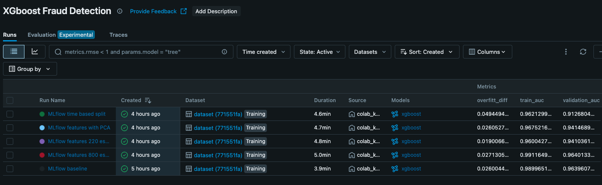
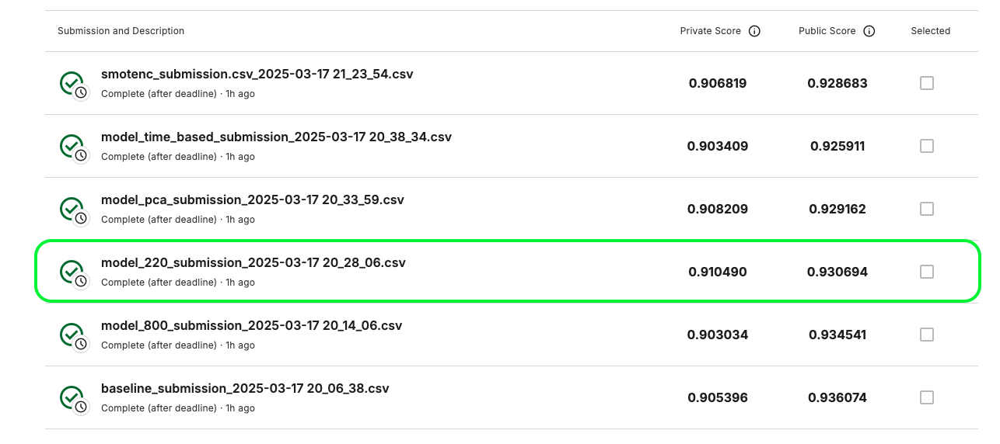

# Fraud Detection using Machine Learning

## 👥 Authors

- **Guy Lissak, 201121126** 🏆  
- **Ron Kipnis, 207275371** ✨  


## 📌 Project Overview
This project aims to build a **fraud detection model** for online transactions using machine learning techniques. The dataset is highly **imbalanced**, making it challenging to detect fraudulent transactions accurately. We employ **feature engineering, data preprocessing, SMOTE balancing, and hyperparameter tuning** to improve the model's performance.

We utilize **XGBoost** for classification, along with **MLflow** to track experiments and monitor model performance.

---

## 📂 Project Structure
```
├── data_loader.py        # Data loading functions
├── data_preprocess.py    # Feature engineering & preprocessing
├── model_utils.py        # Model training & evaluation functions
├── notebooks/            # Jupyter notebooks for EDA & experimentation
├── mlflow_artifacts/     # Stored artifacts and logs
├── README.md             # Project documentation
└── mlflow_client.py      # mlflow python client connection
```

---

## 🛠 Notebook guidlines
- To run any of the notebook, Obtain the dataset from Kaggle: [IEEE-CIS Fraud Detection](https://www.kaggle.com/competitions/ieee-fraud-detection)

### **1️⃣ Fraud_Detection_EDA**
- Includes Explority Data Analysis 

### **2️⃣ Fraud_Detection_Hachathon**
- Main notebook, includes data preprocess, feature engineering, model building and experiment tracking use MLflow.

### **3️⃣ SMOTENC**
- Oversampling experiment - Bonus

### **4️⃣ Track Experiments using MLflow**
```sh
mlflow ui --backend-store-uri sqlite:///mlflow.db
```
- Open [http://localhost:5000](http://localhost:5000) to view logs and artifacts.

---

## 🏆 Key Features & Approaches

### ✅ **Feature Engineering**
- Categorical encoding (Label Encoding)
- PCA for dimensionality reduction (V features)
- Transaction-based feature engineering

### ✅ **Handling Missing Data**
- Numeric: **Mean imputation**
- Categorical: **Mode imputation**

### ✅ **Balancing Data**
- **SMOTENC** oversampling for minority fraud class

### ✅ **Model Training & Tuning**
- **XGBoost** classifier with GPU acceleration
- Hyperparameter tuning for optimal performance using `RandomSearchCV`

### ✅ **Model Evaluation**
- **AUC-ROC Curve** to measure predictive performance
- **Precision-Recall Curve** for threshold calibration
- **Confusion Matrix** to analyze misclassifications

---

## 🧠 Models (validation set)


---

## 📊 Kaggle Results

- **Best private score:** ~0.91
- **Best model:** model_220


---

## 📝 License

This project is for educational purposes and follows Kaggle's dataset usage guidelines.
